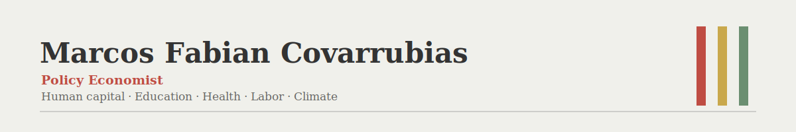

### About

I'm a policy economist and Ph.D. candidate at the University of Maryland. I build large-scale empirical studies that link climate and economic shocks to human-capital outcomes — births, child health, learning, and labor mobility — using administrative microdata across the U.S. and Mexico. I care about reproducibility, and I orchestrate LLM agents across my research pipelines.

 

### What I work on

- **Climate shocks and children's outcomes.** How heat, drought, and wildfire smoke shape birth outcomes, infant health, and student performance — linking administrative records to climate and pollution data across thousands of U.S. and Mexican counties.
- **Barriers to mobility within countries.** What holds workers back from moving to higher-return sectors and regions — disentangling selection on human capital from sector-specific returns to schooling using Mexican panel microdata.
- **AI-augmented research workflows.** Agent-ready repository structures and custom skills so LLMs can run code, manage data pipelines, review analysis, and synthesize literature alongside me.

### Technical work

- Cleaning, merging, and documenting large administrative and survey panels in Stata, R, and Python
- Reproducible pipelines under version control; HPC clusters (Slurm); LaTeX
- Publication-quality tables and figures; spatial data and remote-sensing inputs
- Orchestrating LLM agents (Claude Code, ChatGPT) across research projects

### Elsewhere

- Writing on economics, human capital, and policy — [marcfabianco.substack.com](https://marcfabianco.substack.com)
- Email — [mfbnco@gmail.com](mailto:mfbnco@gmail.com)
- [School of Public Policy, University of Maryland](https://spp.umd.edu/our-community/faculty-staff/marcos-fabian)
- [Health, Opportunity, and Wellbeing Lab (HOWL)](https://howl.umd.edu)
